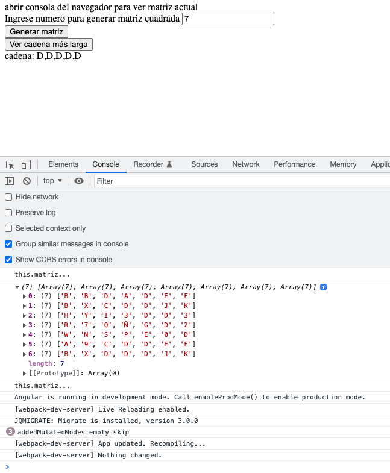

# Emerios

This project was generated with [Angular CLI](https://github.com/angular/angular-cli) version 13.1.3.

## Development server

Correr `ng serve` para correr proyecto y abrir `http://localhost:4200/`.

abrir consola para ver matriz actual, mediante botón generar matriz se genera matriz dinamica, según numero ingresado en input.

mediante boton ver cadena más larga, se puede obtener la cadena más larga según matriz armada dinamicamente o con la matriz por defecto.

